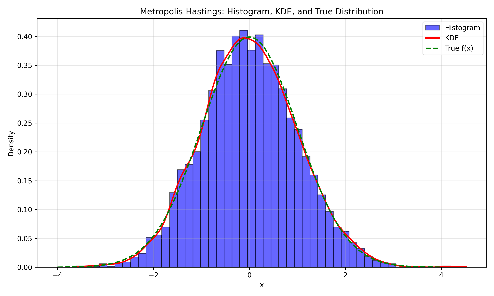
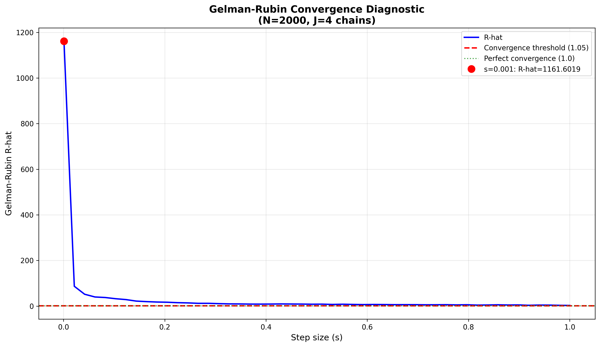

# Reflection on Part 1: Implementing the Metropolis-Hastings Algoritm

## Introduction

This reflection documents the challanges, thought proceses, and learning experiances encountered while implementing the Metropolis-Hastings algorithm for sampling from a standard normal distribtuion. The task initally seemed  straightforward from the mathematical description, but translating the theoritical concepts into working code proved to be way more challenging than I anticipated.

## Initial Struggles with Mathematical Notation  

### Understnading the Acceptance Ratio

The first major hurdle was understanding what the mathematical expression r(x*, x_{i-1}) = f(x*) / f(x_{i-1}) actualy meant in practical terms. The notation was so confusing - I kept asking myself: "Is this a divison? A ratio? How do I even compute this without getting numerical errors?. The challenge of dealing with log-space and optimizing to not recieve `inf` or `nan` required quite some tinkering. (See lines 20-30 in `metropolis_hastings.py`)  

## Question A: Visualising the Results

### Monte Carlo Estimates

Computing the sample mean and standard deviation (lines 48-49) was straightforward once I had the samples:  
```python 
sample_mean = np.mean(samples)
sample_std = np.std(samples, ddof=1)
```

The `ddof=1` parameter was something I had to look up. Apperantly it gives the unbiased sample standard deviation. Without it, the estimates were slightly off and again took quite a while to figure it out and only due to the help of stack overflow answers.

### Creating the Visualizaton

The plot generation (lines 54-78) required combining three different representations:
1: A histogram of the samples
2: A kernel density estimte (KDE)
3: The true target distribtuion 

The histogram code (lines 58-59):
```python
plt.hist(samples, bins=50, density=True, alpha=0.6, color='blue',
         label='Histogram', edgecolor='black')
```

## Question B: Gelman-Rubin Diagnostic - The Real Challange

### Understanding Multiple Chains

The Gelman-Rubin diagnostic was conceptualy much harder. The idea of running multiple chains with diferent starting points and comparing their convergance was not intuative at all. Why do we even need multiple chains? What does "convergance" even mean in this context? I was pretty confused.

After re-reading the question multiple times (and watching some youtube videos and promting LLM's), I understood: if the chains have converged to the same distribution, they should have similar means and variances regardless of where they started. This is what R-hat measures aparently.

### Implementing the R-hat Calculation

The R-hat formula was the most mathematically dense part and honestly gave me a lingering headache.

R̂ = sqrt((B + W) / W)

The implementation (lines 106-126) required careful atention to the formulas:
```python
def calc_rhat(chains):
    J = len(chains)  # number of chains
    N = len(chains[0])  # length of each chain
    
    M_j = np.array([np.mean(chain) for chain in chains])  # chain means
    V_j = np.array([np.var(chain, ddof=1) for chain in chains])  # chain variances
    
    W = np.mean(V_j)  # within-chain varience
    M = np.mean(M_j)  # overall mean
    B = N / (J - 1) * np.sum((M_j - M)**2)  # between-chain varience
    
    R_hat = np.sqrt((B + W) / W)
    
    return R_hat
```

### The Burn-in Period  Problem  

One major issue I encounterd was that with very small step sizes (s=0.001), the chains would start far from the target distribtuion and take forever to converge. This is why I added a burn-in period (line 136):
```python
burnin = 500  # throw away first 500 samples    
```

The implementation (lines 147-149):
```python
full_chain = run_chain(x0=init_vals[j], N=N_b+burnin, s=s_b, seed=j*100)
chain = full_chain[burnin:]  # discard burn-in  
```

This was curcial! Without burn-in, the R-hat values were wrong/off, as the chains fail to  reached the stationary distribtuion. Took me a couple of tinkering to find the most optimal cut of point. 

### Choosing Starting Values

Another subtle issue: I initially used starting values  like [-10, -5, 5, 10] which were too far apart. With small step sizes, the chains would never converge! I changed to closer values (line 141):
```python
init_vals = [-0.5, -0.2, 0.2, 0.5] 
```

This made a huge difference in convergence behavior. I didn't know starting values mattered so much...


*Figure 1: Histogram, KDE, and true distribtuion showing succesful sampling from N(0,1)*


*Figure 2: R-hat convergance diagonstic across diferent step sizes*

## Conclusion

What seemed like a simple algorithm on paper turned into a complex implementaton challange. The main dificulties were understanding how to compute acceptence ratios without numerial errors. Fine tuning by choosing the  apropriate parametrs shuch as burn-ins, starting values and step sizes.  

The experiance taught me that statistical algoritms require careful atention to numerial stability, paramter tuning, and validaton, clearly nothing for the faint hearted and definately not something you can rush through the night before the deadline.

