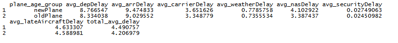
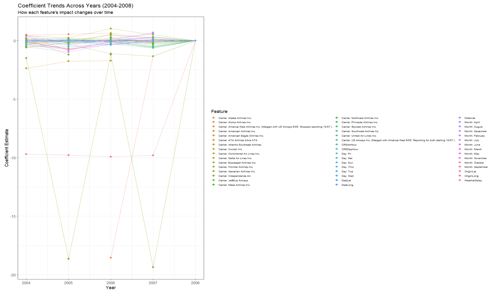

# Part 2: Flight Delay Analysis - Code Review and Methodology

## Overview

This review examines the R code implimentation used to anaylze flight delay patterns from 2004-2008 using a comprehensive dataset of U.S. domestic flights. The analysis adresses three key questons regarding optimal travel times, aircraft age effects on delays, and factors influencing flight diversions.

## Technical Implementation

### Data Infrastructure

The analysis employs a robust SQLite database tool to handle the dataset in R. The implementation begins by establishing a database connection and systematicaly importing both compressed (.bz2) and standard CSV files:

```r
con <- dbConnect(SQLite(), "dataverse_db.sqlite")
```

This approach allows for:
- Efficient handling of multi-gigabyte datasets without memory overflow (and inspecting of tables in Rstudio)
- SQL-based querying

The data loading mechanism intelligently processes both CSV and BZ2 compressed files, automatically extracting table names from filenames and populating the database with appropriate schema inference.

## Question A: Optimal Travel Times to Minimize Delays

### Methodology

The analysis evaluates delays across seven distict categories as defined by the FAA's Aviation System Performance Metrics (ASPM):
- Departure delays      
- Arrival delays  
- Carrier delays (crew, maintenance, cleaning, baggage)
- Weather delays
- National Airspace System (NAS) delays (ATC issues)
- Security delays
- Late aircraft delays

**Reference:** Federal Aviation Administration. "Types of Delay." ASPM Help Documentation. https://www.aspm.faa.gov/aspmhelp/index/Types_of_Delay.html#NAS_Delay

The code impliments a SQL query using UNION ALL to aggregate data across all five years (2004-2008), filtering out cancelled and diverted flights to focus on operational delays:   

```sql
WHERE f.Cancelled = 0 AND f.Diverted = 0
```

### Key Findings

**Between 2004-2008, Saturday emerged as the day with the least travel delays.** However, this conclusion requires nuanced interpretation, as the pattern does not hold uniformly across all  individual delay types.


The standard averaging approach (including negative values for early arrivals/departures) provides the industry-standard metric used by airlines and regulators for performence evaluation.

### Alternative Analysis: Generated and Absorbed Delays

A secondary analysis was conducted to examine the dynamics of delay generation and absorbtion within the National Airspace System (NAS), following the network-based methodology outlined by Xu et al. in their multi-factor model of airport delays. 

**Reference:** Xu, N., et al. "Multi-Factor Model for Airport Delays." Center for Air  Transportation Systems Research, George Mason University, p. 3, Chapter "Definition and previous research." https://catsr.vse.gmu.edu/pubs/XuMultiFactorModelAirportDelaysTRBv6.pdf 

#### Network Perspective on Delays

In an interconnected, large-scale transportation network such as NAS, airports function as nodes and air corridors serve as links connecting these airports. An aircraft traverses a subset of these nodes and links throughout the course of a day, being affected by each sequentially. This network structure creates a cascading effect where delays can propogate through the system.

#### Delay Classification Framework     

Delays occurring at airport nodes are classified as **airport delays**, encompassing the period from aircraft gate arrival time to wheels-off time. This includes turn-around operations but excludes taxi-in delays, which are grouped with airborne delays due to their correlation with inter-arrival distances durign the landing process.

**Positive delays** represent **airport-generated delays** that arise when an aircraft takes more time in any operational phase then scheduled. Conversly, **negative delays** represent **airport-absorbed delays** that occur when an aircraft completes operational phases faster then scheduled. This same framework applies to airborne operations: positive airborne delays indicate **airborne-generated delays**, while negative values indicate **airborne-absorbed delays**.

A critical metric in this framework is  **inbound delay**, which represents the acumulated value of previous leg airport delays and airborne delays. The total delay experienced by a flight can be expressed as:

**Total Delay = Generated Delay + Inbound Delay - Absorbed Delay**

#### Analysis Results

This generated-and-absorbed delay analysis reveals the same general trend with Saturday remaining optimal for minimizing delays. However, this approach provides deeper insights into the delay dynamics and other possible ways of breaking down and viewing the data:


By focusing on positive (generated) delays, this anaylsis reflects the actual time passengers experiance when delays occur, offering a more passenger-centric perspective on delay impacts. It also reveals the system's capacity to absorb delays through operational efficiency gains. The patterns observed in the standard averaging approch are preserved, confirming the robustness of the Saturday recomendation while providing additional context about how delays propogate and are mitigated within the network.

## Question B: Aircraft Age and Delay Correlation  

### Challenges in Defining Aircraft Age

To answer this question satisfacory, we would need to use aviation industry's definition of aircraft age. **The actual differentiation between a "new" and "old" aircraft should be based on flight hours logged on the airframe, not calendar years. An alternative indicator could be the pressurization cycles of a given airframe.** This data, however, is only attainable by accessing the aircrafts logbook and viewing its maintainance cycles. Manufacturing age is not the determinating factor of defining a new or used aircraft.   

1. **Not publicly available** - Flight hour logs are maintained in individual aircraft logbooks
2. **Not accessible in the provided dataset** - Only manufacturing year is available
3. **Expensive/hard to obtain** - Attempting to reverse-engineer tracked hours through platforms like FlightRadar24 would be:
   - Cost intensive
   - Time consuming
   - Yield inconsistent data, especially for:   
     - General Aviation (GA) flights
     - Untracked flights 
     - Historical periods before comprehensive tracking
     - recycling/resuing/changing of registration numbers 
     (not a constant fixed unique id)

### Implementation Approach

Given these constraints, I defined an arbitrary but reasonable threshold: aircraft 20+ years old are classified as "old planes", given that most airframes retire or are considered old after 20-30 years of continued service. Planes under the 20 year threshold are simply considered "new planes". The classification uses the manufacturing year column from the plane-data.csv file:

```r
CASE
    WHEN (f.Year - p.Year) < 20
    THEN 'newPlane'
    ELSE 'oldPlane'
END AS plane_age_group 
```

The analysis aggregates delays across both categories, again excluding cancelled and diverted flights, and evaluates both standard averages and positive-delays-only metrics.

### Findings    

**Old planes consistently experience fewer delays than newer aircraft.** This counterintuitive finding holds across all delay types and remains consistent using standard averaging calculations. Unfortunatly the resions behind these delay differences are not explainable with this given dataset. However the actual time difference is minimal.



This trend persists across different analytical approaches and data subsets, suggesting potential factors which we could only assume, as they are not visable in the data provided. Possible factors could be:
- Cews experiance with older aircraft
- Better-established/simpler routines/porcesses
- Route assignments (planes may fly specific types of routes)
- Survivor bias (only well-maintained/builed/reliable "older" aircraft remain in service)

## Question C: Factors Influencing Flight Diversions

### Hardware Challenges

This analysis presented significant computational challenges due to the massive scale of the dataset .    

**Multiple system crashes** occurred across different devices when attempting to process the full dataset. The sheer volume of data points (millions of flights across five years) overwhelmed system resources durign:
- Data loading and preprocessing
- Model fitting operations
- Visualization rendering
- Code debugging and testing
- Reconfiguring of Rstudio requiring 2 clean reinstalls due to read write permissions errors with libraries


Hours were lost attempting to organize and streamline the plotting of multiple graphs per year. The complexity of managing numerous categorical variables (months, days, carriers) resulted in plot points becomming jumbled and mixed up despite repeated attempts at organization. Sorting them by group without setting new baslines, failed tries to define the zero/first index and allowing for presentable and readable plots. Altering names and labels of the airline names, ... All being said, more time and focus still can be spent optimizing the graphs for this section.

### Solution: Strategic Sampling

To address these computational constraints, the code implements a **random sampling approach with a fixed seed** to ensure reproducibility:

```r
set.seed(123) # for reproducibility
flights_sampled <- flights_tmp %>%
    sample_frac(0.10) # 10% sample

```

This 10% random sample:
- Greatly reduces runtime and memory requirments
- Maintains statistical validity through proper random sampling (not that relevent in this massive dataset as patterns remain stable)
- Preserves the general outcome and trends
- Enables anaylsis on standard hardware

### Methodology

The anaylsis employs logistic regression to model flight diversions, incorporating:

**Temporal factors:**
- Month (seasonal patterns)
- Weekday 
- Scheduled departure hour
- Scheduled arrival hour  

**Operational factors:**    
- Carrier name
- Flight distance
- **Weather delays** (included despite not being explicitly required)

**Geographic factors:**
- Origin airport coordinates (latitude/longitude)
- Destination airport coordinates (latitude/longitude)

### Weather as a Critical Factor

**Weather emerged as the detrimental defining factor for flight diversions.** While not explicitly required in the assignment specifications, weather data was deliberatly included because:
- It represents real-world operational constraints
- It provides crucial explanatory power for diversion decisions
- It reflects actual airline decision-making processes
- It visually demonstrates the impact of weather on flight diversions

The logistic regression model was fitted seperately for each year (2004-2008) with the given data sets:  

```r
model <- glm(
    Diverted ~ Month + DayOfWeek + CarrierName +
      CRSDepHour + CRSArrHour + Distance + WeatherDelay +
      OriginLat + OriginLong + DestLat + DestLong,
    data = model_data,
    family = binomial()
)
```

### Visualization Strategy

1. **Individual year plots** - Seperate coefficient plots for each year (2004-2008) showing the relative importance of each factor in the given year.
2. **Trend analysis** - A combined plot showing the patterns over time

Despite the organizational challenges mentioned earlier, the final implimentation successfully produces interpretable visualizations that reveal:
- Consistent weather impact across all years
- Carrier-specific patterns
- Temporal trends (time, day & month)  in diversion factors 



## Python Implementation Comparison

It is worth noting that the graphs produced within the Python implimentation appear to have returned cleaner, more readable results compared to the R visualizations. This improvement is posibly due to slight enhancements in data aggregation processes prior to plotting. The Python workflow may have benefited from a different library being matplotlib/seaborn and using a slightly altered approache to handling categorical variables.    


## References

1. Federal Aviation Administration. "Types of Delay." ASPM Help Documentation. https://www.aspm.faa.gov/aspmhelp/index/Types_of_Delay.html#NAS_Delay

2. Xu, N., et al. "Multi-Factor Model for Airport Delays." Center for Air Transportation Systems Research, George Mason University. https://catsr.vse.gmu.edu/pubs/XuMultiFactorModelAirportDelaysTRBv6.pdf